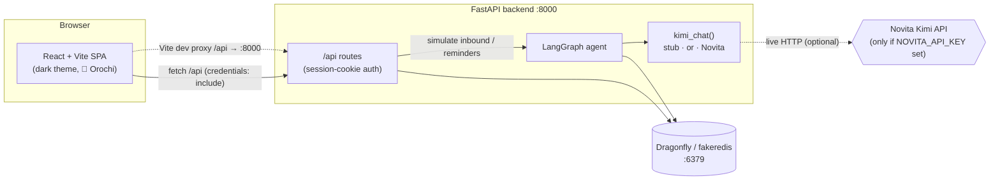
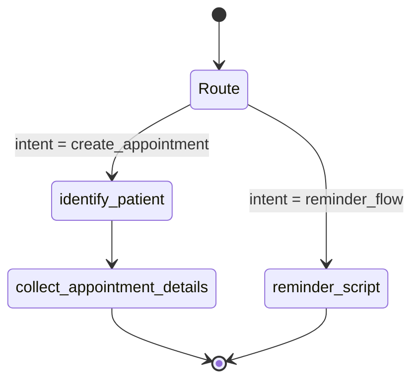

# 🐉 Orochi

**Orochi** is a HIPAA-conscious clinic voice-agent prototype. It demonstrates an
inbound/outbound phone-agent workflow for a medical clinic — identifying patients,
booking appointments, and running appointment-reminder call batches — powered by a
[LangGraph](https://langchain-ai.github.io/langgraph/) agent and a
[Novita](https://novita.ai/) (Kimi) LLM.

The whole system **runs fully offline by default**:

- **Telephony (Twilio) is simulated** — there is a Simulator page and REST endpoints
  that drive the agent as if calls were coming in, so no phone provider is required.
- **The LLM is stubbed** unless a `NOVITA_API_KEY` is provided — a deterministic
  stub extracts a plausible date/time from the caller's message, so flows are
  reproducible with zero external dependencies.
- **Storage** uses [Dragonfly](https://www.dragonflydb.io/) (a Redis-compatible
  store). If Dragonfly is unreachable, the backend transparently falls back to an
  in-process [`fakeredis`](https://pypi.org/project/fakeredis/), so the API works
  with no infrastructure at all.

> 📓 **Product requirements & design** live in the Obsidian **[`vault/`](./vault/)**
> (see also [`prd.md`](./prd.md)). Browse `vault/00 - Overview`, `01 - Architecture`,
> `02 - Data & Integrations`, and `03 - Flows` for the full PRD, data model, and
> flow diagrams.

## Screenshots

A tour of the UI (full gallery in **[`docs/screenshots/`](./docs/screenshots/)**):

| Login | Dashboard | Schedule |
|-------|-----------|----------|
|  |  |  |

The **Schedule** tab lets clinic staff mark a weekly template of available 45-minute
slots; the agent snaps every booking request to the nearest open, unbooked slot
(never revealing slot boundaries to the patient).

---

## Architecture

| Layer        | Technology                                                        |
| ------------ | ----------------------------------------------------------------- |
| **Frontend** | React 18 + Vite + TypeScript SPA, dark themed, sidebar layout     |
| **Backend**  | Python 3.11, FastAPI, session-cookie auth                         |
| **Agent**    | LangGraph state machine (`identify_patient` → `collect_appointment_details` / `reminder_script`) |
| **LLM**      | Novita Kimi via `app/agent/llm.py::kimi_chat` (stubbed when offline) |
| **Storage**  | Dragonfly (Redis-compatible), with `fakeredis` fallback           |
| **Infra**    | Docker Compose (`dragonfly`, `backend`, `frontend`)               |

- **Auth** — passwords are hashed with `passlib[bcrypt]`; the session is a signed
  cookie (`orochi_session`) carrying the user's email, signed with `SECRET_KEY` via
  `itsdangerous`. All non-auth `/api` routes require a valid session (`401` otherwise).
- **REST API** — everything is under `/api` (JSON). Highlights:
  `/api/auth/{login,logout,me}`, `/api/patients`, `/api/appointments`,
  `/api/calls`, `/api/simulate/inbound`, `/api/simulate/reminders`, `/api/health`.
- **Agent** — `CallState` (a `TypedDict`) flows through LangGraph nodes.
  Routing uses `add_conditional_edges` on `intent`:
  `create_appointment` → `identify_patient` → `collect_appointment_details` → END;
  `reminder_flow` → `reminder_script` → END.



**Agent flow (inbound call):**



---

## Quick start

### Login credentials

A single admin user is **seeded on backend startup**:

```
email:    admin@orochi.local
password: orochi123
```

### (A) Docker Compose — everything at once

```bash
cp .env.example .env          # optional: add NOVITA_API_KEY to go live
docker compose up --build
```

Then open:

- Frontend: <http://localhost:5173>
- Backend API: <http://localhost:8000/api/health>

The backend connects to the `dragonfly` service via
`DRAGONFLY_URL=redis://dragonfly:6379`.

### (B) Local dev

**Storage** — you have two options:

- **Dragonfly via Docker** (recommended for parity):
  ```bash
  docker run --rm -p 6379:6379 dragonflydb/dragonfly --logtostderr
  ```
- **No storage at all** — just skip the step above. If the backend cannot reach
  `DRAGONFLY_URL`, it automatically falls back to an in-process `fakeredis`, so
  everything still works (data is not persisted across restarts).

**Backend:**

```bash
cd backend
python3.11 -m venv .venv && source .venv/bin/activate
pip install -r requirements.txt
cp ../.env.example .env        # optional; sensible defaults are built in
uvicorn app.main:app --reload
```

The API is now on <http://localhost:8000>. On startup it seeds the admin user.

**Frontend:**

```bash
cd frontend
npm install
npm run dev
```

The Vite dev server runs on <http://localhost:5173> and proxies `/api` →
`http://localhost:8000`, so the SPA and API share a session cookie during development.

---

## Offline / mock behavior

Orochi is designed to be demoed on a laptop with **no accounts and no network**:

| Dependency          | Offline default                                                                 | How to enable the real thing                          |
| ------------------- | ------------------------------------------------------------------------------- | ----------------------------------------------------- |
| **Telephony**       | Simulated — use the **Simulator** page or `POST /api/simulate/inbound` / `POST /api/simulate/reminders`. | (Not part of this prototype — Twilio is stubbed out.) |
| **LLM (Novita Kimi)** | Deterministic stub in `app/agent/llm.py`: parses a date/time from the caller's message, or defaults to `"next available"`, and returns JSON. | Set `NOVITA_API_KEY` (see below).                     |
| **Storage**         | `fakeredis` in-process if Dragonfly is unreachable.                             | Run Dragonfly and point `DRAGONFLY_URL` at it.        |

### Enabling Novita (live LLM)

1. Obtain an API key from Novita.
2. Set it in your environment / `.env`:
   ```bash
   NOVITA_API_KEY=sk-...your-key...
   # optional override; this is the default:
   NOVITA_URL=https://api.novita.ai/v1/chat/completions
   ```
3. Restart the backend (or `docker compose up` — the key is passed through to the
   `backend` service).

When `NOVITA_API_KEY` is set, `kimi_chat()` makes a real HTTP `POST` to Novita to
extract appointment details and generate reminder scripts. When it is unset, the
deterministic stub is used and no network calls are made.

---

## Simulating calls

- **Inbound call** — from the **Simulator** page (or `POST /api/simulate/inbound`
  with `{phone, name, message?}`). The LangGraph inbound flow identifies/creates the
  patient, extracts appointment details via the LLM, writes an appointment, and
  returns `{call, actions[], appointment?}` — the agent's actions and transcript are
  shown in the UI.
- **Reminder batch** — the **Simulator** page's reminder button (or
  `POST /api/simulate/reminders`) runs the reminder flow over upcoming appointments
  and returns `{results:[{appointment_id, script, call_uuid}]}`.

---

## Project layout

```
orochi/
├── backend/            FastAPI app, LangGraph agent, storage layer
│   ├── app/
│   ├── requirements.txt
│   └── Dockerfile
├── frontend/           React + Vite + TypeScript SPA
│   └── Dockerfile
├── vault/              Obsidian vault — PRD, architecture, data & flows
├── prd.md              Product requirements (top-level copy)
├── docker-compose.yml
├── .env.example
└── README.md
```
