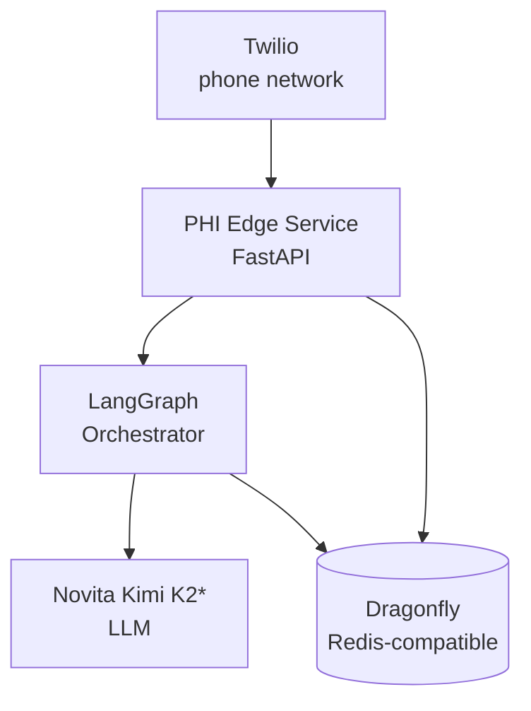

# 🐉 Orochi — Product Requirements

> [!abstract] TL;DR
> **Orochi** is a HIPAA-conscious voice-agent prototype for clinics. It answers **inbound** patient calls to book appointments and places **outbound** reminder calls — orchestrated with **LangGraph**, powered by **Novita Kimi K2\***, backed by **Dragonfly** (Redis-compatible), and connected to the phone network via **Twilio**.

> [!info] Reading order
> 1. [[Product Scope]] — what we're building and for whom
> 2. [[Architecture Overview]] — components & how they fit
> 3. [[Data Model]] + [[Dragonfly Integration]] — persistence
> 4. [[LangGraph Design]] + [[Novita Kimi Integration]] — the agent brain
> 5. [[Call Flows]] — inbound & outbound wiring
> 6. [[Open Questions]] — decisions still needed

## Map of content

## The pieces

| Component | Role | Note |
|-----------|------|------|
| Twilio | Telephony webhooks (inbound / outbound status) | [[Call Flows]] |
| PHI Edge Service | Parses events, mints UUIDs, guards the PHI boundary | [[Architecture Overview]] |
| LangGraph | Dialog & decision orchestration | [[LangGraph Design]] |
| Novita Kimi K2\* | LLM for conversation and extraction | [[Novita Kimi Integration]] |
| Dragonfly | KV / hashes / lists for prototype storage | [[Data Model]] · [[Dragonfly Integration]] |

> [!warning] HIPAA stance (prototype)
> Name, phone, and appointment metadata are treated as **PHI**. For this local prototype it all lives in Dragonfly, with a designed **PHI edge** and UUIDs so later HIPAA hardening is straightforward. Not yet production-safe.

## Source

This vault was generated from the original [[Original PRD Source|flat PRD]].
