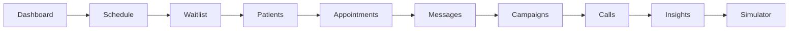

# 🧵 UX Demo Thread — showcasing the features

> [!note] Part of [[Orochi PRD]] · pairs with [[Roadmap]]
> A running thread of ideas + decisions for making the UI *demonstrate* every feature clearly. Newest notes at the top. Append as we iterate.

## The demo narrative (what a viewer should experience)

A clinic staffer logs in and can, in five minutes, see the agent **answer calls, book/reschedule/cancel, triage an emergency, send reminders, get confirmations back, fill a cancellation from the waitlist, run a recall campaign, and read call analytics** — all without any real phone or LLM.

## Tab map (post-build)

## Thread

> [!tip] 2026-07-08 — One-click demo prompts
> The **Simulator** now has "example call" buttons (Book / Reschedule / Cancel / Hours / Emergency) that prefill the caller message, so a viewer can trigger each intent with one click and watch the intent badge, sentiment, summary, and (for emergencies) the escalation banner update.

> [!tip] 2026-07-08 — Surface the intelligence
> Every simulated call returns intent + language + sentiment + summary. These render as chips/cards in the Simulator result and roll up into **Insights** (sentiment distribution, booking conversion, no-show risk). The story: the agent isn't just booking — it's *understanding* and *reporting*.

> [!tip] 2026-07-08 — Close the loop visibly
> **Messages** shows the two-way confirmation: send a reminder → simulate the patient replying "confirm/cancel" → the appointment status flips in place. **Waitlist → Backfill** then books the freed slot and logs the mock SMS. The viewer sees a full cancellation-recovery loop.

## Open UX ideas (backlog)

> [!question] Not yet built
> - **Live "incoming call" toast** + call-pop panel (patient history) when a simulated call starts.
> - **Timeline view per patient** — calls, messages, appointments interleaved.
> - **Guided demo mode** — a scripted walkthrough that runs the whole narrative automatically.
> - **Emergency queue** badge in the top bar when an escalation is pending.
> - **Dark mode** toggle (currently light-only) for demo environments.
> - Animated agent "thinking" state while the LangGraph flow runs.

Link back: [[Roadmap]] · [[Schedule & Availability]] · [[Call Flows]]
