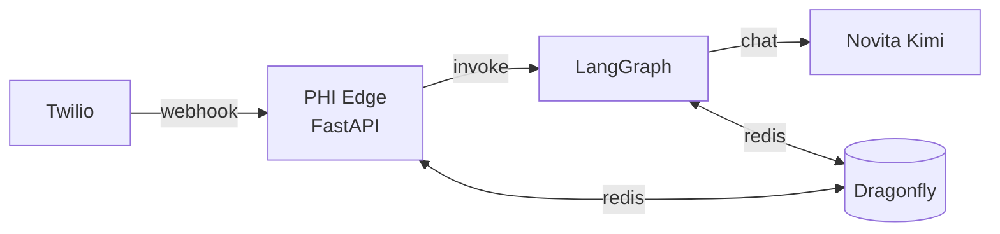

# Architecture Overview

> [!note] Part of [[Orochi PRD]]

## Components

> [!abstract] Twilio (mocked or real)
> - Webhook endpoints for inbound calls (`/twilio/inbound`) and outbound status callbacks (`/twilio/outbound-status`).
> - For the prototype, Twilio payloads can be **mocked locally**.

> [!abstract] PHI Edge Service — Python (FastAPI or similar)
> - Receives Twilio events, parses caller phone / name.
> - Stores patient + appointment data in [[Dragonfly Integration|Dragonfly]].
> - Issues `patient_uuid` and `call_uuid`.

> [!abstract] LangGraph Agent Orchestrator
> - Graph nodes: `collect_patient_info`, `schedule_appointment`, `prepare_reminder_script`.
> - Uses [[Novita Kimi Integration|Novita Kimi K2*]] for dialog and decision logic. See [[LangGraph Design]].

> [!abstract] Dragonfly data store (local Docker)
> - Redis-compatible KV, hashes & lists for patient records, appointments, and conversation state.

## Diagram

## Related

- [[Data Model]]
- [[Call Flows]]
- [[Open Questions]]
