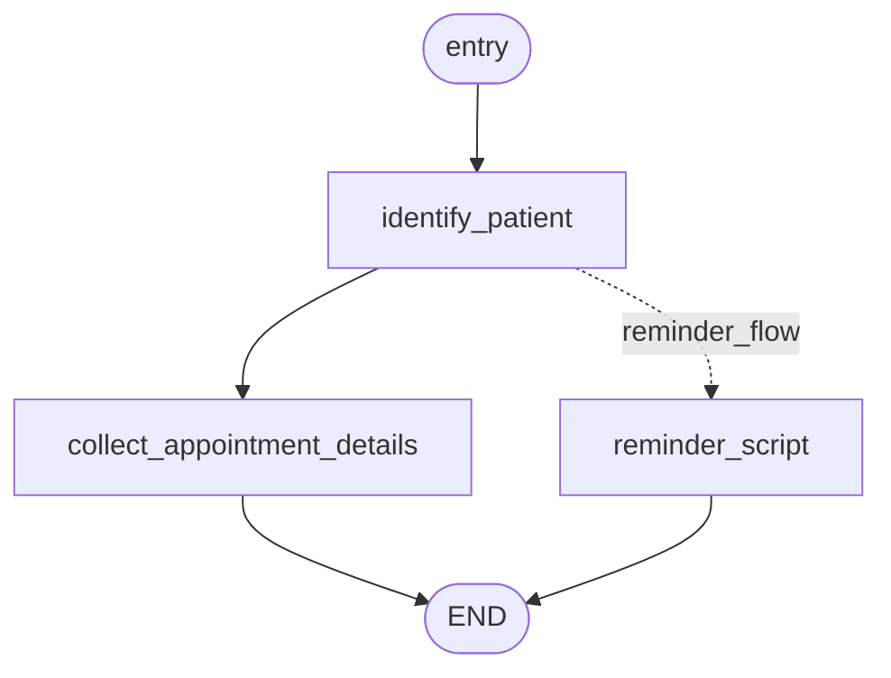

# LangGraph Design

> [!note] Part of [[Orochi PRD]] · uses [[Novita Kimi Integration]]

## State definition

A typed dict-like state carried through the graph:

```python
from typing import TypedDict, Optional, List
from langgraph.graph import StateGraph

class CallState(TypedDict, total=False):
    call_uuid: str
    patient_uuid: Optional[str]
    caller_phone: Optional[str]
    patient_name: Optional[str]
    intent: Optional[str]          # "create_appointment" or "reminder_flow"
    appointment_id: Optional[str]
    actions: List[str]             # log of agent decisions
```

## Nodes

| Node | Responsibility |
|------|----------------|
| `identify_patient_node` | Resolve `caller_phone` → `patient_uuid`, or create a new patient |
| `collect_appointment_details_node` | Use the LLM to capture date/time, then store the appointment |
| `reminder_script_node` | Generate an outbound reminder script |

## Graph skeleton

```python
from langgraph.graph import StateGraph, END

graph = StateGraph(CallState)

def identify_patient(state: CallState) -> CallState:
    # TODO: Dragonfly lookup by phone, create if not exists
    state["actions"].append("identify_patient")
    return state

def collect_appointment_details(state: CallState) -> CallState:
    state["actions"].append("collect_appointment_details")
    # TODO: call Novita Kimi to converse and capture datetime/location
    return state

def reminder_script(state: CallState) -> CallState:
    state["actions"].append("reminder_script")
    # TODO: call Novita Kimi to generate safe reminder text
    return state

graph.add_node("identify_patient", identify_patient)
graph.add_node("collect_appointment_details", collect_appointment_details)
graph.add_node("reminder_script", reminder_script)

def router(state: CallState) -> str:
    if state.get("intent") == "create_appointment":
        if state.get("patient_uuid") is None:
            return "identify_patient"
        if state.get("appointment_id") is None:
            return "collect_appointment_details"
        return END
    elif state.get("intent") == "reminder_flow":
        return "reminder_script"
    return END

graph.set_entry_point("identify_patient")
graph.add_edge("identify_patient", "collect_appointment_details")
graph.add_edge("collect_appointment_details", END)
graph.add_edge("reminder_script", END)

call_agent_app = graph.compile()
```

> [!bug] Spec inconsistency to resolve
> The original PRD both hard-wires edges *and* calls `graph.set_router(...)` (not a real LangGraph API). During build we'll use **conditional edges** (`add_conditional_edges`) driven by `intent`. Tracked in [[Open Questions]].

## Flow



## Reference

- [LangGraph on GitHub](https://github.com/langchain-ai/langgraph)
