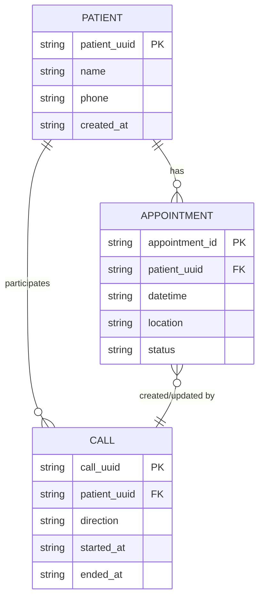
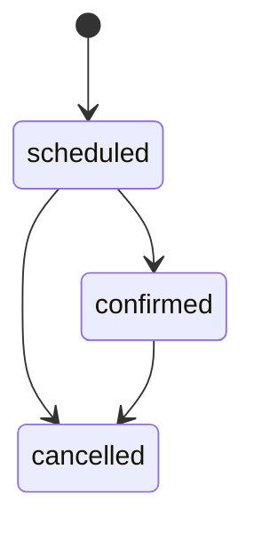

# Data Model

> [!note] Part of [[Orochi PRD]] · implemented via [[Dragonfly Integration]]

Simple Redis structures for the prototype:

> [!info] `patient:{patient_uuid}` → hash
> `name`, `phone`, `created_at`

> [!info] `appointment:{appointment_id}` → hash
> `patient_uuid`, `datetime`, `location`, `status` — one of `scheduled`, `confirmed`, `cancelled`

> [!info] `call:{call_uuid}` → hash
> `patient_uuid`, `direction` (`inbound` / `outbound`), `started_at`, `ended_at`

> [!info] `appointments_by_patient:{patient_uuid}` → list
> list of `appointment_id`

## Entity relationships

## Status lifecycle

