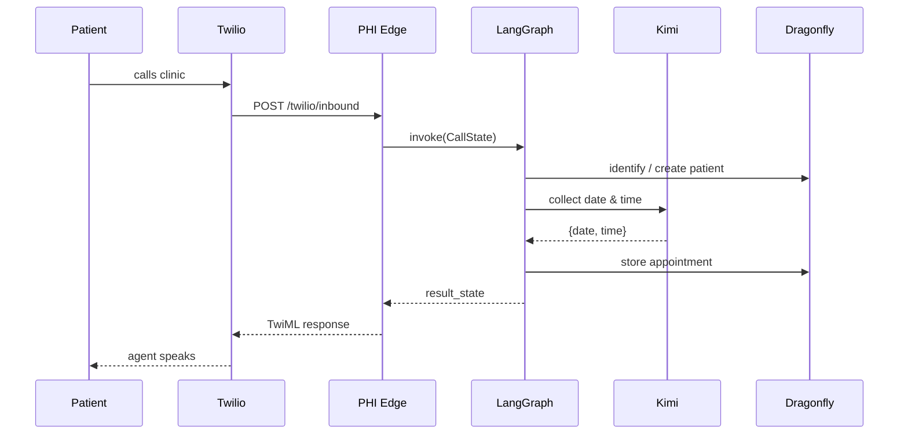

# Call Flows

> [!note] Part of [[Orochi PRD]]

## Inbound webhook handler

```python
from fastapi import FastAPI, Request

app = FastAPI()

@app.post("/twilio/inbound")
async def twilio_inbound(request: Request):
    form = await request.form()
    caller_phone = form.get("From")
    call_sid = form.get("CallSid")
    # For prototype, assume name is spoken later and set by agent later
    initial_state = CallState(
        call_uuid=call_sid,
        caller_phone=caller_phone,
        intent="create_appointment",
        actions=[],
    )
    result_state = call_agent_app.invoke(initial_state)
    # TODO: return TwiML or appropriate response to Twilio
    return {"status": "ok", "state": result_state}
```

## Outbound reminder scheduler

> [!tip] Prototype approach
> A simple script scans Dragonfly for upcoming appointments and calls the agent to generate scripts.

```python
import datetime

def get_upcoming_appointments():
    # TODO: implement a simple scan based on datetime stored in appointment hashes
    return []

def run_reminder_batch():
    for appt in get_upcoming_appointments():
        state = CallState(
            call_uuid=str(uuid.uuid4()),
            patient_uuid=appt["patient_uuid"],
            appointment_id=appt["id"],
            intent="reminder_flow",
            actions=[],
        )
        result_state = call_agent_app.invoke(state)
        # TODO: use result_state to trigger Twilio outbound call with reminder text

if __name__ == "__main__":
    run_reminder_batch()
```

## Sequence — inbound booking


