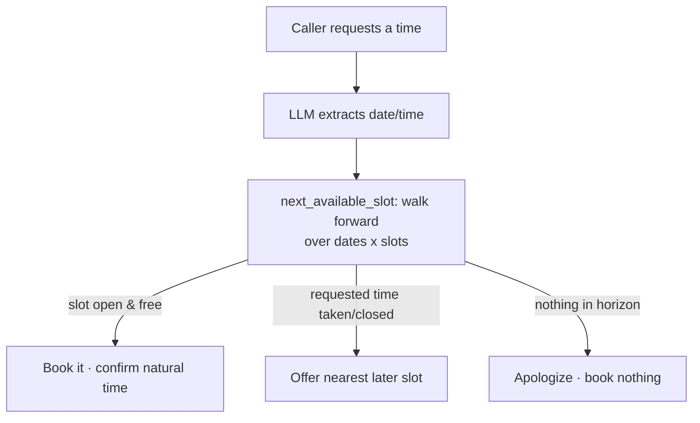

# Schedule & Availability

> [!note] Part of [[Orochi PRD]] · constrains [[Call Flows]] · extends [[Data Model]]

Clinic staff mark a **weekly recurring template** of times the clinic is open for
bookings. The booking agent snaps every request to the nearest available slot.

## Slot model

> [!info] 45-minute slots, 08:00–18:00
> 13 slots/day: `08:00, 08:45, 09:30, 10:15, 11:00, 11:45, 12:30, 13:15, 14:00, 14:45, 15:30, 16:15, 17:00` (last ends 17:45). Weekdays `mon…sun`. Configurable via `CLINIC_OPEN`, `CLINIC_CLOSE`, `SLOT_MINUTES`.

Slots are an **internal** concept — the patient-facing transcript states the
confirmed time naturally and never mentions slot boundaries.

## Availability storage

Redis set `schedule:availability`, members `"{weekday}:{HH:MM}"` (e.g. `mon:09:30`).
Seeded default: **Mon–Fri fully open, weekends closed**. A slot is bookable when it
is in the template **and** not already taken by an active (non-cancelled)
appointment on that date.

## Agent snapping (nearest available slot)

- Walks **forward** from the requested time across `SCHEDULE_HORIZON_DAYS` (default 21).
- Skips closed weekdays and already-booked slots.
- Logs the adjustment in the internal `actions` log (e.g. *"Requested 10:37 → offered nearest available slot 11:00"*).

## API surface

| Endpoint | Purpose |
|----------|---------|
| `GET /api/schedule` | slots + weekly availability template |
| `POST /api/schedule/slot` | toggle one `{weekday, time, available}` |
| `POST /api/schedule/day` | toggle a whole weekday column |
| `POST /api/appointments` | now **409s** if the datetime isn't an open, unbooked slot |

## Where it lives

- Slot math: `backend/app/scheduling.py`
- Availability storage: `backend/app/db.py`
- Router: `backend/app/routers/schedule.py`
- Agent integration: `backend/app/agent/graph.py` (`collect_appointment_details`)
- UI: `frontend/src/pages/Schedule.tsx` (the **Schedule** tab)
